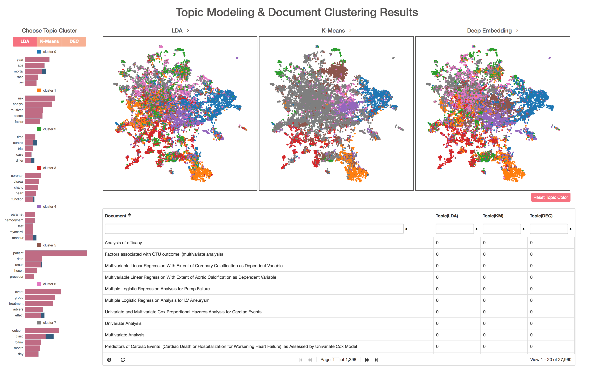

# Comparative Visualization of  Document Clustering Models

Models in comparison : LDA(Topic Modeling), K-Means, Deep Embedding Clustering

A visualization tool to compara document clustering results of clustering models.

## Overview

| Juxtapose 3 Models that using different techniques to Topic Modeling |
| :----------------------------------------------------------: |
|                        |

|               Demo Video                |
| :-------------------------------------: |
|  |

## Project Description

Document clustering is one of the widely researched tasks in the natural language processing field. However, as it is based on an unsupervised learning approach, there is no guarantee that clustering results are accurate. This requires domain experts' validation of results, which can be tedious and repetitive.

Due to this reason, we developed the following tool to provide visualization on clustering results from different techniques to assist the evaluation of individual models and the quality of clusters.

## Clustering Algorithms

Clustering models are divided into several types according to using algorithms. We choose the following three models: Latent Dirichlet Allocation(LDA), K-means, Deep Embedded Clustering(DEC).
* Latent Dirichlet Allocation(_Porbabilistic methods_): LDA considers each item as a mixture of various clusters with the probabilistic distribution.
* K-Means(_Centroid-based methods_): K-Means decides the cluster of each item to minimize the within-cluster sum of squares(WCSS, variance)
* Deep Embedded Clustering(_Low dimensional embedding method_): DEC uses a deep neural network to choose features to represent each cluster

## Dimension Reduction

|                        U-MAP vs t-SNE                        |
| :----------------------------------------------------------: |
|  |
| *Umap: Uniform manifold approximation and projection for dimension reduction (McInnes, L., & Healy, J., 2018)* |

To visualize documents, we used Uniform Manifold Approximation(U-MAP). While t-SNE is the most popular/traditional technique to reduce dimensions for preprocessing and projection, it requires high computing power and can be time-consuming. Recently, a new technique called U-MAP has been developed. This technique preserves the global structure more extensively and has a faster time complexity than t-SNE.

## Extraction Keywords & Entity Recognition

|                     Extraction Keywords                      |
| :----------------------------------------------------------: |
|  |

To verify clusters, we extract main keywords from each cluster. Keywords are determined by probability based on the frequency of a word in each cluster over frequency in overall documents. We use the pyLDAvis library to extract keywords for the LDA model and [kmeans to pyLDAvis](https://github.com/lovit/kmeans_to_pyLDAvis) for K-means and DEC model.

|                      Entity Recognition                      |
| :----------------------------------------------------------: |
|  |

Entity Recognition is another information to verify the cluster quality. We provide not only entities of each document but also the frequency of documents in the same cluster. To recognize entities, we use the spaCy library with the English dataset(en_core_web_sm, including Vocabulary, Syntax, Entities).

## Implementation

|             Overall architecture of application              |
| :----------------------------------------------------------: |
|  |

The application is developed with Electron as a cross-platform desktop app and packaged with pyinstaller. Backend is implemented with Flask(model training, feature reduction, and entity recognition), while javascript and d3.js are used for visualization. 

## Usage

* **For Dev environment**

1. Need to install all required packages by
   `pip install -r ./requirements.txt`
2. Copy Spacy Data File
    * Download data file: `python -m spacy download en`
    * Copy data file("\<Spacy Data Path>/en_core_web_sm-2.0.0") to "npl_data/en/en_core_web_sm-2.0.0" folder
3. Test local server by running
    `python3 py_source/run_app.py`
4. access web via browser by 'localhost:5000'

* **Packaging for Windows 64bit**

1. PyInstaller
    * Package python codes by PyInstaller: `pyinstaller -Fw --distpath ./ ./packaging_task/run_app.spec`
    * Run binary file: `./run_flask.exe` or `npm start`
